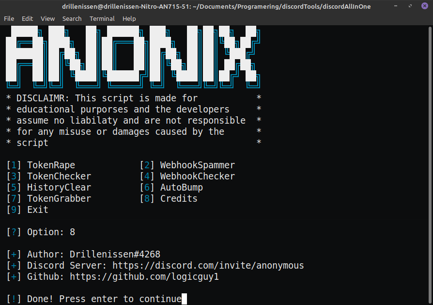

  <h3 align="center">The all in one discord tool</h3>

  <p align="center">
    A tool for discord that includes many features handy for any discord user
    <br />
    <a href="https://github.com/logicguy1/The-all-in-one-discord-tool"><strong>Explore the docs »</strong></a>
    <br />
    <br />
    <a href="https://github.com/logicguy1/The-all-in-one-discord-tool">View Demo</a>
    ·
    <a href="https://github.com/logicguy1/The-all-in-one-discord-tool/issues">Report Bug</a>
    ·
    <a href="https://github.com/logicguy1/The-all-in-one-discord-tool/issues">Request Feature</a>
  </p>
  
## About The Project



The tool has all the features you need to run and raid a discord server
It was made to test bots and administrators in my server

### Built With

* [Requests](https://github.com/psf/requests)
* [Colored](https://gitlab.com/dslackw/colored)

## Getting Started

To get a local copy up and running follow these simple steps.

### Prerequisites
You need to install python, that can be done [here](https://www.python.org)

### Installation
1. Clone the repo
   ```sh
   git clone https://github.com/logicguy1/The-all-in-one-discord-tool.git
   ```
2. Install Python packages
   ```sh
   # Windows:
   py -3 -m pip install requests
   py -3 -m pip install colored
   
   # Unix
   python3.8 -m pip install requests
   python3.8 -m pip install colored
   ```
   
## Usage

Run the `main.py` file using `py -3 main.py` and select an option

_For more examples, please refer to the [Documentation](https://example.com)_

## Roadmap

See the [open issues](https://github.com/logicguy1/The-all-in-one-discord-tool/issues) for a list of proposed features (and known issues).

## Contributing

Contributions are what make the open source community such an amazing place to be learn, inspire, and create. Any contributions you make are **greatly appreciated**.

1. Fork the Project
2. Create your Feature Branch (`git checkout -b feature/AmazingFeature`)
3. Commit your Changes (`git commit -m 'Add some AmazingFeature'`)
4. Push to the Branch (`git push origin feature/AmazingFeature`)
5. Open a Pull Request

## Copyright

© 2020 Drillenissen#4268 all rights reserved

## Contact

Logicguy - [@Drillenissen#4268](https://www.discordapp.com) - logicguy.mailandcontact@gmail.com

Project Link: [https://github.com/logicguy1/The-all-in-one-discord-tool](https://github.com/logicguy1/The-all-in-one-discord-tool)
